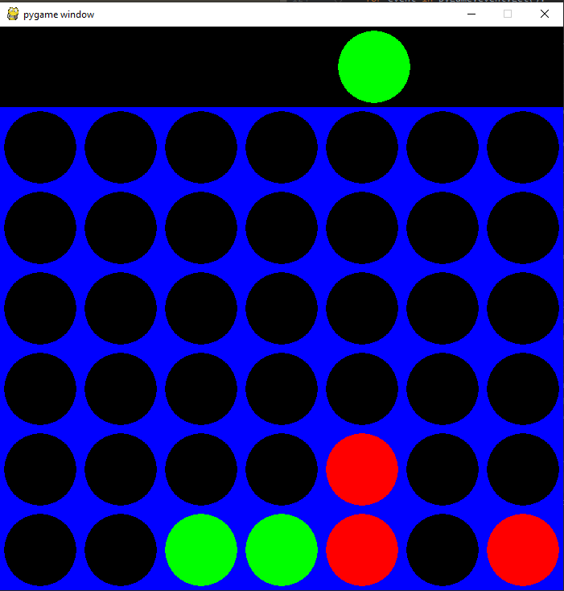
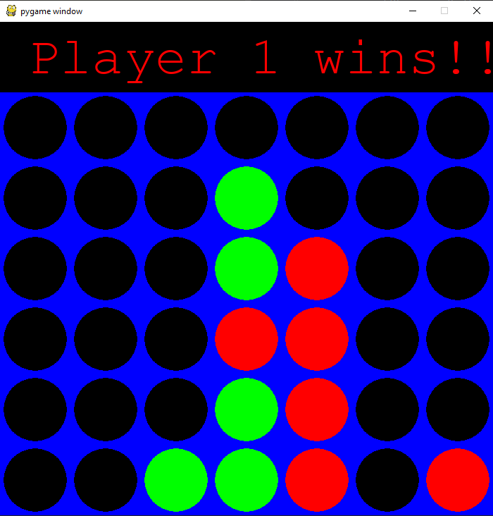
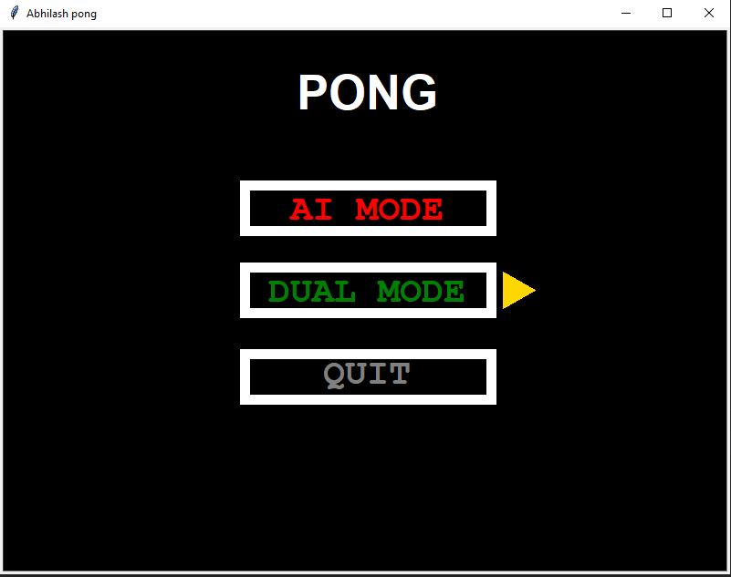
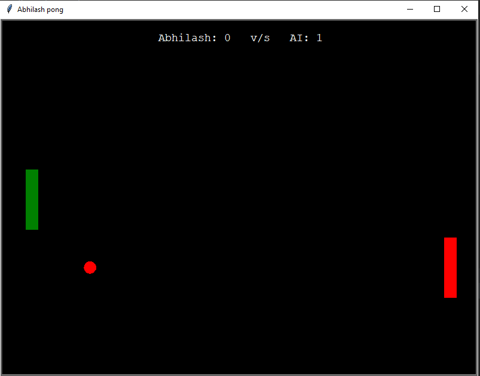
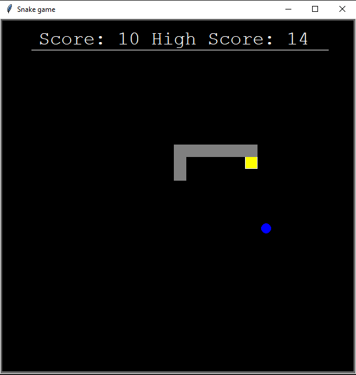

# Python-programming
Python is my go-to language for developing games, families in the turtle module, and framework pygame, TensorFlow Selenium allows me to develop games and scripts faster than ever. I learned python after c++, at the beginning I couldn't help to like python because it is a loosely typed language, I always blame it for its slow operation time. Gradually I understood python is not the one language to rule them all but it has good uses.
 
### Languages & tools :
[][vscode]
[][python]
[][python]
  

|Python Connect Four| Python Connect Four | python Pong Game | python Pong Game  |
|------|-------|-------|------|
|||||
|Python Snake Game| Python TicTacToe | python TicTacToe |
||||
### Connect with me :  

  
 

[website]: https://abhilashtuofficial.github.io/
[vscode]: https://code.visualstudio.com/
[python]: https://github.com/AbhilashTUofficial/Python-programming
