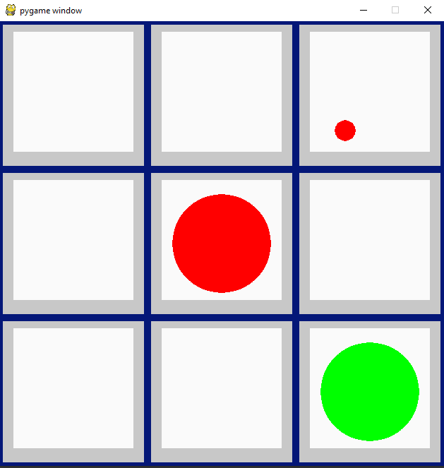

# Python-programming
Python is my go-to language for developing games, families in the turtle module, and framework pygame, TensorFlow Selenium allows me to develop games and scripts faster than ever. I learned python after c++, at the beginning I couldn't help to like python because it is a loosely typed language, I always blame it for its slow operation time. Gradually I understood python is not the one language to rule them all but it has good uses.
 

### Languages & tools :
[][vscode]
[][python]
[][python]
  

### Directory Structure :
    |-- Data structure & Algorithm
    |   |-- Sorting
    |       |-- BubbleSort.py
    |       |-- InsertionSort.py
    |       |-- MergeSort.py
    |
    |-- Learning
    |   |
    |   |-- main.py
    |   |
    |   |-- Intermediate
    |   |   |-- Arrays.py
    |   |   |-- Collections.py
    |   |   |-- Dictionary.py
    |   |   |-- Exceptions.py
    |   |   |-- Generators.py
    |   |   |-- Itertools.py
    |   |   |-- Lambda.py
    |   |   |-- queen_backtracking.py
    |   |   |-- Sets.py
    |   |   |-- Strings.py
    |   |   |-- Tuples.py
    |   |   |-- RandomNumbers.py
    |   |   |-- Decorators.py
    |   |   |-- Json
    |   |   |   |-- data.json
    |   |   |   |-- encode_decode.py
    |   |   |   
    |   |   |-- Logging
    |   |       |-- errorLogs
    |   |       |   |-- errors.log
    |   |       |-- error_setup.py
    |   |       |-- log_setup.py
    |   |       |-- log_tracker.log
    |   |       |-- Logging.py
    |   |       |-- rotating_error_log.py
    |   |       |-- timed_rotation_error_log.py
    |   |       |-- warning_log_tracker.log
    |   |      
    |   |-- TkInter
    |       |-- buttons.py
    |       |-- calculator.ico
    |       |-- calculator.py
    |       |-- checkboxes.py
    |       |-- database.py
    |       |-- dropdown_menu.py
    |       |-- entry.py
    |       |-- file_dialog.py
    |       |-- fonts.py
    |       |-- grid.py
    |       |-- Image_viewer.py
    |       |-- Image.py
    |       |-- learn.py
    |       |-- message_box.py
    |       |-- radio_buttons.py
    |       |-- root_frame.py
    |       |-- slider.py
    |       |-- windows.py
    |
    |-- MazePathFinder
    |   |-- main.py
    |
    |-- Teris-python
    |   |-- tetris.py
    |   |-- README.md
    |
    |-- database.db
    |
    |-- Img
    |   |-- pycharm.png
    |   |-- python.png
    |   |-- pythonConnectFour1.png
    |   |-- pythonConnectFour2.png
    |   |-- pythonPong1.png
    |   |-- pythonPong2.png
    |   |-- pythonSnakeGame.png
    |   |-- pythonTicTacToe1.png
    |   |-- pythonTicTacToe2.png
    |   |-- vscode.png
    |
    |-- README.md

|Python Connect Four| Python Connect Four | python Pong Game | python Pong Game  |
|------|-------|-------|------|
|||||
|Python Snake Game| Python TicTacToe | python TicTacToe |
||||

## Connect with me:  

  
 

[website]: https://abhilashtuofficial.github.io/
[vscode]: https://code.visualstudio.com/
[python]: https://github.com/AbhilashTUofficial/Python-programming
